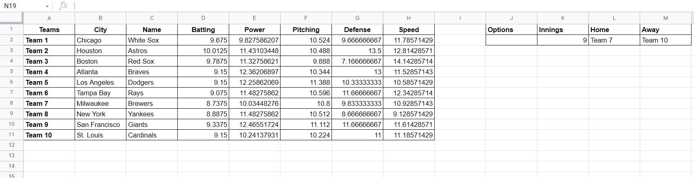
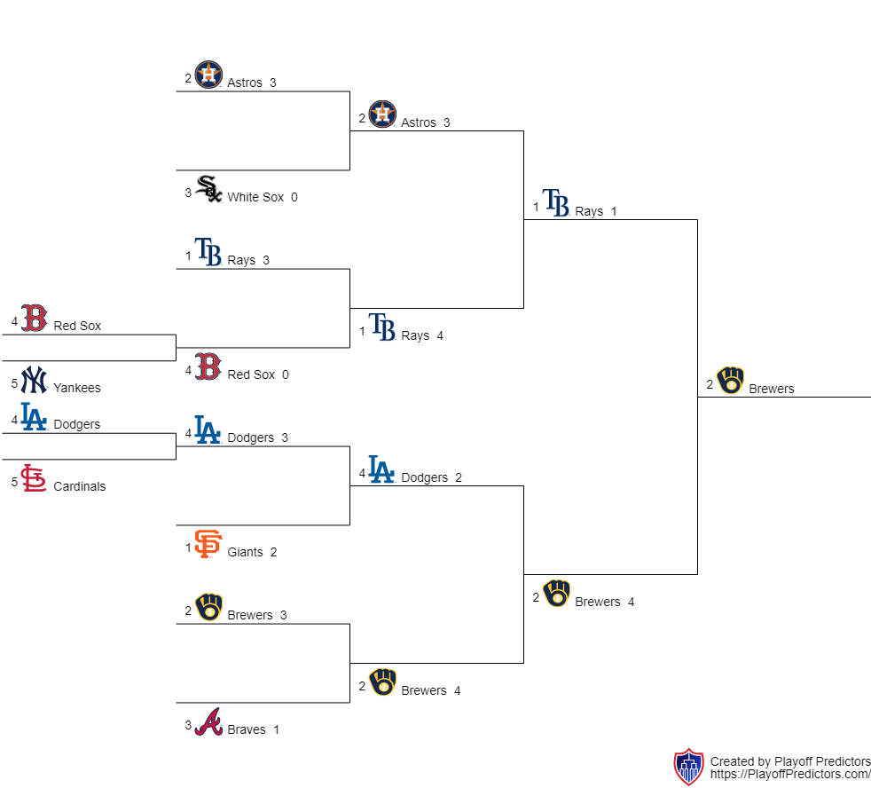
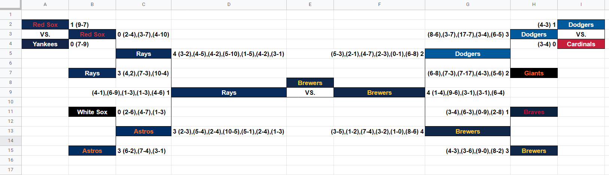
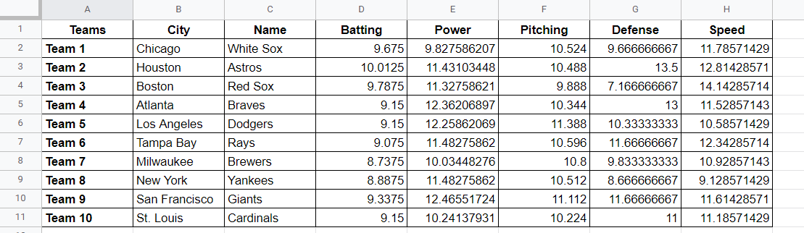

# [Baseball Game Simulator](https://github.com/mamamia5x/Baseball-Game-Simulator)
A baseball game simulator, written in JS.  

To play a game, you first need to have `teamdata`. `teamdata` is the ratings for the two baseball teams. The teams are ranked in 5 categories, those being batting, power, pitching, defense and speed. Each category is ranked on a scale of 1-15 (decimals allowed).

Teamdata can be set two ways, by editing the file `teamdata.json`, or by uploading a csv file, naming it `teamdata.csv` and then running the command `npm run convert` or `node converter.js`. This'll convert the csv file into a json file, allowing the script to read the team data.

Playing a game is simple, just run the command `npm run start` or `node index.js`. It'll simulate the game and put the results in the `output.txt` file.

You don't need NPM to run this script, but Node should be installed. You can run it online at repl.it.

**Note**: CSV file should look like


```csv
Teams,City,Name,Batting,Power,Pitching,Defense,Speed
Team 1,Test,Name,11,8,2,7,10
Team 2,Foo,Bar,10,5,5,10,7
```

# 2021 MLB Playoff Simulation
According to this simulator, the Milwaukee Brewers will win the MLB World Series.  Keep in mind these are simulations, expect different results every time.



A more indepth game bracket shows more detail and game scores. 



Team ratings were generated by me, using stats of the regular season. Obviously, these ratings aren't 100% accurate. 



# 2021 MLB World Series Simulation
Instead of simulating the whole playoffs, this is a simulation of the World Series. 

According to this simulation, the Houston Astros will win the World Series. Keep in mind these are simulations, expect different results every time.

## Game 1
#### Atlanta Leads 1-0
|Team|1|2|3|4|5|6|7|8|9|R|
|:--:|--|--|--|--|--|--|--|--|--|--|
|**ATL**|0|1|1|1|0|0|2|0|0|**5**|
|**HOU**|0|0|0|0|0|0|1|3|0|**4**|
## Game 2
#### Series Tied 1-1
|Team|1|2|3|4|5|6|7|8|9|R|
|:-:|--|--|--|--|--|--|--|--|--|--|
|**ATL**|0|0|0|0|0|0|0|1|0|**1**|
|**HOU**|0|0|2|0|0|0|0|0|X|**2**|
## Game 3
#### Atlanta Leads 2-1
|Team|1|2|3|4|5|6|7|8|9|R|
|:-:|--|--|--|--|--|--|--|--|--|--|
|**HOU**|0|2|0|0|0|0|0|0|0|**2**|
|**ATL**|1|0|0|0|1|1|0|0|X|**3**|
## Game 4
#### Atlanta Leads 3-1
|Team|1|2|3|4|5|6|7|8|9|R|
|:-:|--|--|--|--|--|--|--|--|--|--|
|**HOU**|0|0|0|0|0|0|0|0|0|**0**|
|**ATL**|0|0|0|0|2|1|1|2|X|**6**|
## Game 5
#### Atlanta Leads 3-2
|Team|1|2|3|4|5|6|7|8|9|R|
|:-:|--|--|--|--|--|--|--|--|--|--|
|**HOU**|0|0|2|3|1|0|1|1|2|**10**|
|**ATL**|0|0|1|0|0|0|1|0|1|**3**|
## Game 6
#### Series Tied 3-3
|Team|1|2|3|4|5|6|7|8|9|R|
|:-:|--|--|--|--|--|--|--|--|--|--|
|**ATL**|0|0|0|0|0|0|0|0|1|**1**|
|**HOU**|0|1|0|0|0|0|0|1|x|**2**|
## Game 7
#### Houston Wins 4-3
|Team|1|2|3|4|5|6|7|8|9|R|
|:-:|--|--|--|--|--|--|--|--|--|--|
|**ATL**|0|0|0|0|0|0|1|1|0|**2**|
|**HOU**|0|0|0|0|1|0|0|2|X|**3**|
